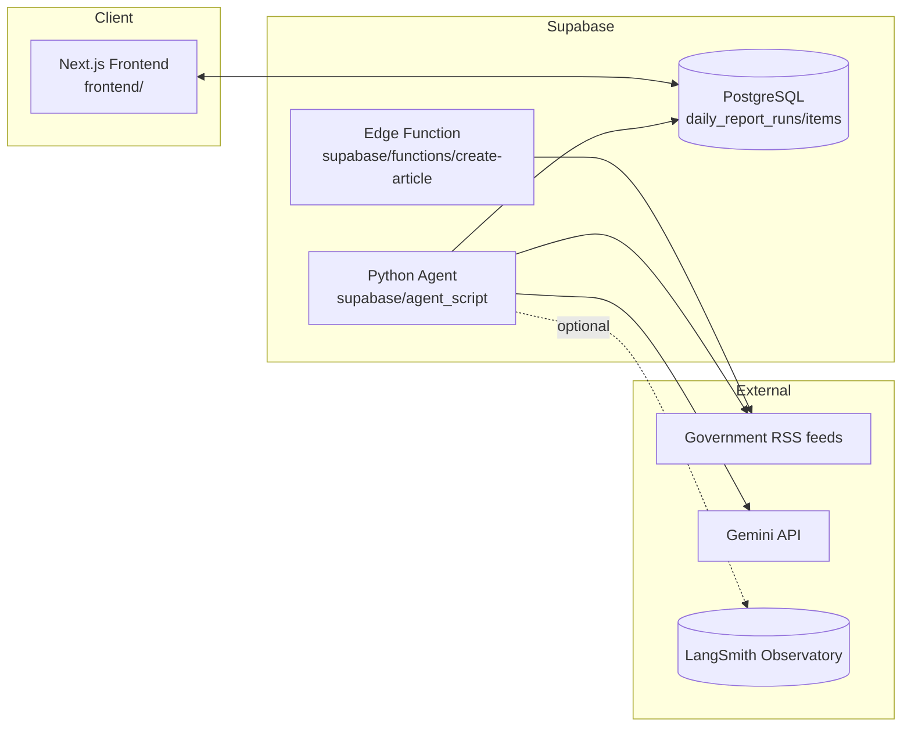

# Journalist App

AI エージェントが日本政府各省庁の RSS を監視し、関連記事や関連資料をクロールして Markdown / JSON 形式のレポートを自動生成するリポジトリです。Supabase（DB & Edge Functions）、Next.js フロントエンド、Python 製オフラインエージェントで構成されています。

## Architecture



- **frontend/**: Next.js app that lists agent runs (`daily_report_runs`) and allows browsing generated summaries.
- **supabase/functions/**: Edge Function (`create-article`) that mirrors the Python agent logic for serverless execution.
- **supabase/agent_script/**: CLI agent that can run locally or in scheduled jobs, persisting the same schema as the Edge Function.
- **backend/** (when present): supplementary services (e.g., orchestrators or cron helpers).

## Repository Layout

| Path | Description |
| --- | --- |
| `frontend/` | Next.js application used to visualize runs and detailed article breakdowns. |
| `supabase/` | Supabase project: SQL migrations, Edge Functions, and the offline Python agent. |
| `docker-compose.yml` | Local stack for Postgres/Supabase to mirror production. |
| `README.md` | This document. For detailed agent usage see `supabase/agent_script/README.md`. |

### Supabase Agent Script Structure

`supabase/agent_script/` ships the offline article generator. Belowは主なファイルと役割です。

| File | Role |
| --- | --- |
| `main.py` | CLI entry point. Loads env/args, initializes Gemini client, runs the reporter, writes JSON, and persists to Postgres. |
| `article_fetcher.py` | Retrieves RSS feeds, fetches linked articles/resources (HTML/PDF/API/画像/動画) with dummy UA headers, and enriches articles with related link analysis. |
| `config.py` | Declares `FeedConfig`, default headers, and the list of supported government RSS feeds. |
| `reporter.py` | Core report generation workflow: orchestrates feed processing, composes prompts, and delegates to the Gemini client. |
| `prompts.py` | Prompt templates for Gemini (RSS summarization, fact extraction, report formatting). |
| `llm_client.py` | Thin Gemini wrapper with RPM throttling, LangSmith instrumentation, and JSON parsing helpers. |
| `db.py` | Persists a run and its per-feed items into Supabase Postgres (`daily_report_runs`, `daily_report_items`). |
| `logger.py` | Structured logging helpers used throughout the agent. |
| `observability.py` | Legacy LangSmith RunTree integrations (kept for reference; current tracing hooks live in `llm_client.py`). |
| `utils.py` | Utility helpers (env loader, text cleaners, JSON parsing with candidate fallbacks, datetime parsing). |
| `README.md` | Usage instructions, environment variables, and flow diagrams dedicated to the agent. |

補助ファイル:

- `.env` / `.env.local` samples to align API keys between Edge FunctionsとCLI。
- `pyproject.toml` / `uv.lock` で依存管理 (`uv` 推奨)。
- `prompts.py` と `article_fetcher.py` が最も変更頻度の高い調整ポイントです。

## Getting Started

1. **Boot local Supabase/Postgres**
   ```bash
   docker compose up -d
   ```
2. **Run the Python agent (offline workflow)**
   ```bash
   cd supabase/agent_script
   uv sync
   GOOGLE_API_KEY=... uv run python main.py --log-level INFO
   ```
3. **Browse results**
   - Frontend: `cd frontend && pnpm dev` (or your package manager) then open the runs list page.
   - Database: check `daily_report_runs` / `daily_report_items` tables via Supabase Studio or `psql`.

### Observability

- Export `LANGSMITH_API_KEY` (and optionally `LANGSMITH_PROJECT`) before running the agent to log each Gemini call via `langsmith.wrappers.wrap_gemini`.
- Set `LANGSMITH_TRACING=false` to disable tracing without touching code.

### Additional Notes

- The Python agent and Edge Function intentionally share schema/contracts so results are interchangeable.
- Dummy `User-Agent` headers are enforced when scraping feeds/resources to avoid 403 responses.
- When editing prompts or feed configs, keep `supabase/agent_script/README.md` updated for downstream users.
