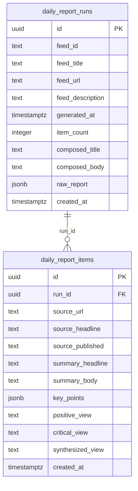

## データベース構成（シンプル版）

記事生成フローを Python スクリプトで完結させるため、保存先となるテーブルを `public` スキーマに 2 つだけ用意しています。

### 1. `daily_report_runs`
| カラム | 型 | 説明 |
| --- | --- | --- |
| `id` | `uuid` PK | レポート実行ごとのID（`gen_random_uuid()`） |
| `feed_id` | `text` | 処理したフィードの識別子（例: `kantei`） |
| `feed_title` | `text` | フィードの名称 |
| `feed_url` | `text` | RSS の URL |
| `feed_description` | `text` | フィードの説明 |
| `generated_at` | `timestamptz` | Python スクリプトで生成した日時 |
| `item_count` | `integer` | 収集できた記事件数 |
| `composed_title` | `text` | Gemini が生成した日次ダイジェストのタイトル |
| `composed_body` | `text` | 日次ダイジェスト本文（5〜7文） |
| `raw_report` | `jsonb` | フィード単位の出力全体（後段処理用） |
| `created_at` | `timestamptz` | DB 登録時刻（`default now()`） |

### 2. `daily_report_items`
| カラム | 型 | 説明 |
| --- | --- | --- |
| `id` | `uuid` PK | 各記事要約のID |
| `run_id` | `uuid` FK | `daily_report_runs.id` を参照 |
| `source_url` | `text` | 参照元記事の URL |
| `source_headline` | `text` | RSS 側のタイトル |
| `source_published` | `text` | RSS で取得できた公開日時文字列 |
| `summary_headline` | `text` | LLM が生成した見出し |
| `summary_body` | `text` | 3 文以内の要約 |
| `key_points` | `jsonb` | 重要ポイント（文字列配列を JSON で保存） |
| `positive_view` | `text` | 肯定的論評 |
| `critical_view` | `text` | 批判的論評 |
| `synthesized_view` | `text` | 肯定＋批判を踏まえた統合コメント |
| `created_at` | `timestamptz` | DB 登録時刻 |

