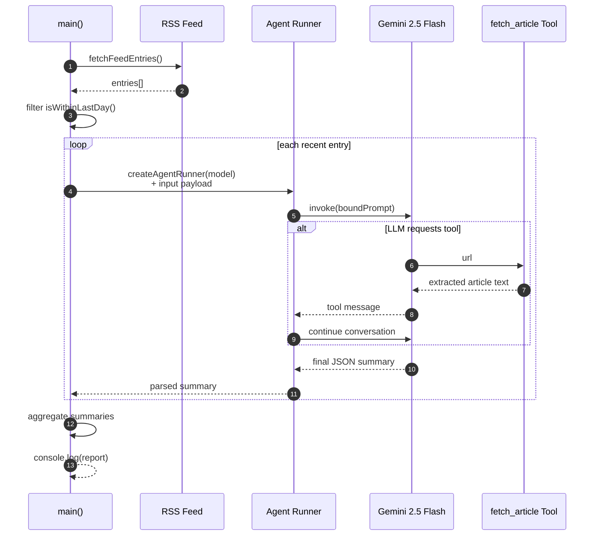

```mermaid
sequenceDiagram
    autonumber
    participant Runner as main()
    participant Feed as RSS Feed
    participant Agent as Agent Runner
    participant LLM as Gemini 2.5 Flash
    participant Tool as fetch_article Tool

    Runner->>Feed: fetchFeedEntries()
    Feed-->>Runner: entries[]
    Runner->>Runner: filter isWithinLastDay()
    loop each recent entry
        Runner->>Agent: createAgentRunner(model)<br/>+ input payload
        Agent->>LLM: invoke(boundPrompt)
        alt LLM requests tool
            LLM->>Tool: url
            Tool-->>LLM: extracted article text
            LLM-->>Agent: tool message
            Agent->>LLM: continue conversation
        end
        LLM-->>Agent: final JSON summary
        Agent-->>Runner: parsed summary
    end
    Runner->>Runner: aggregate summaries
    Runner-->>Runner: console.log(report)
```